# starred-topics

**32 GitHub star lists. 10 extra repositories per list. A catalog of what this account is actually reading.**

This repository is the written index of [github.com/ahmaddroobi99?tab=stars](https://github.com/ahmaddroobi99?tab=stars).

GitHub Lists on that tab are the working taxonomy: CAD kernels, physical AI, on-device compilation, world models, and the fundamentals underneath them. This README does two things:

1. Summarize what each list is *for*.
2. Record **10 extra repositories added per list** on 2026-09-16 — complementary, active, canonical tooling, not another copy of PyTorch / OpenCV / Eigen / ROS 2 / COLMAP unless the list was almost empty.

> Research first. Undergraduate last. Stars are a reading list, not a trophy case.

## Note on starring

The extras below were selected to be starred onto the matching list. The connected GitHub App may lack `user` scope (`403 Resource not accessible by integration`). If a star did not land, the row is still the intended addition. Star counts move; slugs were checked 2026-09-16.

Machine-readable copy: [`catalog/extras.json`](catalog/extras.json).

---

## Map of the lists

```mermaid
flowchart TB
  S[Star lists] --> F[Fundamentals]
  S --> G[Geometry / CAD]
  S --> V[Vision / 3D]
  S --> R[Robots / control / sim]
  S --> I[Inference / serving / data]
  F --> F1[Python 306]
  F --> F2[C++ 139]
  F --> F3[Linux 22]
  F --> F4[CUDA 19]
  F --> F5[LinAlg 18]
  F --> F6[Algos 13]
  F --> F7[Git 20]
  F --> F8[Testing 10]
  F --> F9[Embedded C++ 20]
  F --> F10[Backend 1]
  G --> G1[Code CAD 20]
  G --> G2[Kernels 14]
  G --> G3[BIM 16]
  G --> G4[Rep learning 11]
  G --> G5[Comp geom 12]
  V --> V1[Vision+CUDA 194]
  V --> V2[3D / points 13]
  V --> V3[CV basics 13]
  V --> V4[Neural rendering 24]
  V --> V5[World models 14]
  V --> V6[Deep learning 7]
  R --> R1[Physical AI 95]
  R --> R2[Diff sim 34]
  R --> R3[Robot sensors 29]
  R --> R4[Control 19]
  R --> R5[Tracking 19]
  R --> R6[OpenUSD 9]
  R --> R7[Sim / optics 10]
  I --> I1[Model compile 65]
  I --> I2[Multimodal serving 11]
  I --> I3[LLM + gen CAD 8]
  I --> I4[Vector DBs 5]
```

Counts in the diagram are the list sizes *before* the extras in this commit.

---

## Table of contents

1. [3D Vision and Point Clouds](#1--3d-vision-and-point-clouds--13)
2. [Algorithms and Data Structures](#2--algorithms-and-data-structures--13)
3. [Backend and API Infrastructure](#3--backend-and-api-infrastructure--1)
4. [C++ Fundamentals](#4--c-fundamentals--139)
5. [CAD/BIM Parsing and Review](#5--cadbim-parsing-and-review--16)
6. [CAD Kernels and B-Rep](#6--cad-kernels-and-b-rep--14)
7. [CAD Representation Learning](#7--cad-representation-learning--11)
8. [Code CAD and Parametric Modeling](#8--code-cad-and-parametric-modeling--20)
9. [Computational Geometry and Mesh Processing](#9--computational-geometry-and-mesh-processing--12)
10. [Computer Vision Basics](#10--computer-vision-basics--13)
11. [Control Systems and Robotics](#11--control-systems-and-robotics--19)
12. [CUDA and GPU Basics](#12--cuda-and-gpu-basics--19)
13. [Deep Learning](#13--deep-learning--7)
14. [Differentiable Simulation and Sim-to-Real](#14--differentiable-simulation-and-sim-to-real--34)
15. [Embedded and Real-Time C++](#15--embedded-and-real-time-c--20)
16. [Git Build and Tooling](#16--git-build-and-tooling--20)
17. [Linear Algebra and Math](#17--linear-algebra-and-math--18)
18. [Linux and Systems](#18--linux-and-systems--22)
19. [LLM Agents and Generative CAD](#19--llm-agents-and-generative-cad--8)
20. [Model Compilation and On-Device Inference](#20--model-compilation-and-on-device-inference--65)
21. [Neural Rendering and Gaussian Splatting](#21--neural-rendering-and-gaussian-splatting--24)
22. [OpenUSD and Industrial Scene Graphs](#22--openusd-and-industrial-scene-graphs--9)
23. [Physical AI and Robot Foundation Models](#23--physical-ai-and-robot-foundation-models--95)
24. [Production Multimodal Serving](#24--production-multimodal-serving--11)
25. [Python Fundamentals](#25--python-fundamentals--306)
26. [Robotics and Sensors](#26--robotics-and-sensors--29)
27. [Simulation and Optics](#27--simulation-and-optics--10)
28. [Testing and Software Design](#28--testing-and-software-design--10)
29. [Tracking and Estimation](#29--tracking-and-estimation--19)
30. [Vector Databases and Data Platforms](#30--vector-databases-and-data-platforms--5)
31. [Vision and CUDA](#31--vision-and-cuda--194)
32. [World Models and Spatial Intelligence](#32--world-models-and-spatial-intelligence--14)

---

## Catalog

Each table is the **+10 extras** for that list, not a dump of the existing stars.

### 1 · 3D Vision and Point Clouds · 13

Feed-forward geometry, point-cloud backbones, matching, and LiDAR odometry for scan-to-scene work.

| # | Repository | Why it is here |
| --- | --- | --- |
| 1 | [facebookresearch/vggt](https://github.com/facebookresearch/vggt) | CVPR 2025 Best Paper — feed-forward visual geometry transformer |
| 2 | [isl-org/Open3D](https://github.com/isl-org/Open3D) | Canonical 3D data structures and processing |
| 3 | [facebookresearch/pytorch3d](https://github.com/facebookresearch/pytorch3d) | Differentiable 3D operators |
| 4 | [naver/dust3r](https://github.com/naver/dust3r) | Pair-to-pointmap geometric foundation model |
| 5 | [naver/mast3r](https://github.com/naver/mast3r) | DUSt3R successor with dense matching |
| 6 | [Pointcept/PointTransformerV3](https://github.com/Pointcept/PointTransformerV3) | Modern point-cloud backbone |
| 7 | [cvg/LightGlue](https://github.com/cvg/LightGlue) | Local feature matching |
| 8 | [PRBonn/kiss-icp](https://github.com/PRBonn/kiss-icp) | Simple robust LiDAR odometry |
| 9 | [google/draco](https://github.com/google/draco) | Mesh / point-cloud compression |
| 10 | [open-mmlab/mmdetection3d](https://github.com/open-mmlab/mmdetection3d) | 3D detection toolbox |

### 2 · Algorithms and Data Structures · 13

Readable implementations and interview-grade problem sets. Not a second copy of CLRS notes.

| # | Repository | Why it is here |
| --- | --- | --- |
| 1 | [TheAlgorithms/Python](https://github.com/TheAlgorithms/Python) | Reference implementations |
| 2 | [trekhleb/javascript-algorithms](https://github.com/trekhleb/javascript-algorithms) | Annotated algorithm catalog |
| 3 | [williamfiset/Algorithms](https://github.com/williamfiset/Algorithms) | Graph + DS course code |
| 4 | [cp-algorithms/cp-algorithms](https://github.com/cp-algorithms/cp-algorithms) | e-maxx modernized |
| 5 | [azl397985856/leetcode](https://github.com/azl397985856/leetcode) | Structured LeetCode notes |
| 6 | [halfrost/LeetCode-Go](https://github.com/halfrost/LeetCode-Go) | Go solutions |
| 7 | [algorithm-visualizer/algorithm-visualizer](https://github.com/algorithm-visualizer/algorithm-visualizer) | Visual walkthroughs |
| 8 | [TheAlgorithms/C-Plus-Plus](https://github.com/TheAlgorithms/C-Plus-Plus) | C++ reference implementations |
| 9 | [youngyangyang04/leetcode-master](https://github.com/youngyangyang04/leetcode-master) | Interview track |
| 10 | [keon/algorithms](https://github.com/keon/algorithms) | Compact Python DS/algos |

### 3 · Backend and API Infrastructure · 1

This list was almost empty. Ten production API / messaging / telemetry pieces so backend is not a footnote.

| # | Repository | Why it is here |
| --- | --- | --- |
| 1 | [fastapi/fastapi](https://github.com/fastapi/fastapi) | Python API default |
| 2 | [encode/starlette](https://github.com/encode/starlette) | ASGI core under FastAPI |
| 3 | [grpc/grpc](https://github.com/grpc/grpc) | RPC + codegen |
| 4 | [envoyproxy/envoy](https://github.com/envoyproxy/envoy) | L7 proxy / mesh dataplane |
| 5 | [apache/kafka](https://github.com/apache/kafka) | Log-shaped integration bus |
| 6 | [redis/redis](https://github.com/redis/redis) | Cache + streams |
| 7 | [nats-io/nats-server](https://github.com/nats-io/nats-server) | Lightweight messaging |
| 8 | [caddyserver/caddy](https://github.com/caddyserver/caddy) | Automatic-HTTPS reverse proxy |
| 9 | [trpc/trpc](https://github.com/trpc/trpc) | Typed RPC for TypeScript |
| 10 | [open-telemetry/opentelemetry-collector](https://github.com/open-telemetry/opentelemetry-collector) | Telemetry pipeline |

### 4 · C++ Fundamentals · 139

The list is already large. These are complementary libraries, not more beginner tutorials.

| # | Repository | Why it is here |
| --- | --- | --- |
| 1 | [NVIDIA/cccl](https://github.com/NVIDIA/cccl) | CUDA C++ core libraries |
| 2 | [microsoft/proxy](https://github.com/microsoft/proxy) | Allocation-free polymorphism |
| 3 | [simdjson/simdjson](https://github.com/simdjson/simdjson) | SIMD JSON |
| 4 | [stephenberry/glaze](https://github.com/stephenberry/glaze) | Reflection + JSON |
| 5 | [google/highway](https://github.com/google/highway) | Portable SIMD |
| 6 | [facebook/folly](https://github.com/facebook/folly) | Facebook C++ kit |
| 7 | [bloomberg/bde](https://github.com/bloomberg/bde) | Bloomberg C++ foundation |
| 8 | [capnproto/capnproto](https://github.com/capnproto/capnproto) | Schema + RPC |
| 9 | [ericniebler/range-v3](https://github.com/ericniebler/range-v3) | Ranges origin |
| 10 | [carbon-language/carbon-lang](https://github.com/carbon-language/carbon-lang) | Experimental C++ successor |

### 5 · CAD/BIM Parsing and Review · 16

IFC read/write, web viewers, Revit interchange, and building-energy lineage.

| # | Repository | Why it is here |
| --- | --- | --- |
| 1 | [IfcOpenShell/IfcOpenShell](https://github.com/IfcOpenShell/IfcOpenShell) | IFC parser + geometry engine |
| 2 | [ThatOpen/engine_web-ifc](https://github.com/ThatOpen/engine_web-ifc) | WASM IFC read/write |
| 3 | [ThatOpen/engine_components](https://github.com/ThatOpen/engine_components) | Web BIM components |
| 4 | [xeokit/xeokit-sdk](https://github.com/xeokit/xeokit-sdk) | BIM/IFC viewer SDK |
| 5 | [opensourceBIM/BIMserver](https://github.com/opensourceBIM/BIMserver) | Server-side IFC platform |
| 6 | [Autodesk/revit-ifc](https://github.com/Autodesk/revit-ifc) | Revit IFC import/export |
| 7 | [NREL/OpenStudio](https://github.com/NREL/OpenStudio) | Building energy on IFC/gbXML lineage |
| 8 | [ladybug-tools/honeybee](https://github.com/ladybug-tools/honeybee) | Environmental analysis on building models |
| 9 | [AutodeskAILab/Building-GAN](https://github.com/AutodeskAILab/Building-GAN) | Generative building programs |
| 10 | [AutodeskAILab/occwl](https://github.com/AutodeskAILab/occwl) | Lightweight pythonocc topology wrapper |

### 6 · CAD Kernels and B-Rep · 14

Open CASCADE and the Python/Rust layers people actually script.

| # | Repository | Why it is here |
| --- | --- | --- |
| 1 | [CadQuery/cadquery](https://github.com/CadQuery/cadquery) | Pythonic B-Rep on OCCT |
| 2 | [gumyr/build123d](https://github.com/gumyr/build123d) | Builder-mode CAD on OCP |
| 3 | [tpaviot/pythonocc-core](https://github.com/tpaviot/pythonocc-core) | SWIG OCCT bindings |
| 4 | [CadQuery/OCP](https://github.com/CadQuery/OCP) | pybind11 OCCT bindings |
| 5 | [FreeCAD/FreeCAD](https://github.com/FreeCAD/FreeCAD) | Full desktop CAD on OCCT |
| 6 | [CadQuery/CQ-editor](https://github.com/CadQuery/CQ-editor) | CadQuery GUI |
| 7 | [bernhard-42/jupyter-cadquery](https://github.com/bernhard-42/jupyter-cadquery) | Notebook viewer |
| 8 | [ricosjp/truck](https://github.com/ricosjp/truck) | Rust CAD kernel |
| 9 | [solvespace/solvespace](https://github.com/solvespace/solvespace) | Constraint CAD kernel |
| 10 | [Open-Cascade-SAS/OCCT](https://github.com/Open-Cascade-SAS/OCCT) | Official Open CASCADE kernel |

### 7 · CAD Representation Learning · 11

B-Rep networks, ABC-scale datasets, and 2025–2026 text/video-to-CAD papers.

| # | Repository | Why it is here |
| --- | --- | --- |
| 1 | [AutodeskAILab/JoinABLe](https://github.com/AutodeskAILab/JoinABLe) | Learn CAD joints |
| 2 | [deep-geometry/abc-dataset](https://github.com/deep-geometry/abc-dataset) | ABC big CAD dataset |
| 3 | [ghadinehme/VideoCAD](https://github.com/ghadinehme/VideoCAD) | CAD UI video imitation |
| 4 | [col14m/cadrille](https://github.com/col14m/cadrille) | Multimodal CAD + online RL |
| 5 | [lllssc/Drawing2CAD](https://github.com/lllssc/Drawing2CAD) | Drawing to CAD sequence |
| 6 | [EESJGong/Graph-CAD](https://github.com/EESJGong/Graph-CAD) | Text-to-CAD graph representations |
| 7 | [skanti/Scan2CAD](https://github.com/skanti/Scan2CAD) | Scan to CAD alignment |
| 8 | [AutodeskAILab/BRepNet](https://github.com/AutodeskAILab/BRepNet) | Topological message passing on solids |
| 9 | [AutodeskAILab/Fusion360GalleryDataset](https://github.com/AutodeskAILab/Fusion360GalleryDataset) | Reconstruction / segmentation CAD data |
| 10 | [AutodeskAILab/UV-Net](https://github.com/AutodeskAILab/UV-Net) | Learn from B-Rep UV-grids |

### 8 · Code CAD and Parametric Modeling · 20

Programmable solids: OpenSCAD libraries, CadQuery tooling, Zoo, text-to-CAD.

| # | Repository | Why it is here |
| --- | --- | --- |
| 1 | [openscad/openscad](https://github.com/openscad/openscad) | Programmatic CSG CAD |
| 2 | [BelfrySCAD/BOSL2](https://github.com/BelfrySCAD/BOSL2) | OpenSCAD standard library |
| 3 | [partcad/partcad](https://github.com/partcad/partcad) | Package manager for parts |
| 4 | [Adam-CAD/CADAM](https://github.com/Adam-CAD/CADAM) | Text-to-CAD application |
| 5 | [flowful-ai/cad-skill](https://github.com/flowful-ai/cad-skill) | CadQuery skill for agents |
| 6 | [bernhard-42/vscode-ocp-cad-viewer](https://github.com/bernhard-42/vscode-ocp-cad-viewer) | VS Code OCP viewer |
| 7 | [KittyCAD/modeling-app](https://github.com/KittyCAD/modeling-app) | Zoo Design Studio |
| 8 | [nophead/NopSCADlib](https://github.com/nophead/NopSCADlib) | OpenSCAD parts + project framework |
| 9 | [kennetek/gridfinity-rebuilt-openscad](https://github.com/kennetek/gridfinity-rebuilt-openscad) | Parametric storage system |
| 10 | [CadQuery/CQ-editor](https://github.com/CadQuery/CQ-editor) | CadQuery GUI |

### 9 · Computational Geometry and Mesh Processing · 12

Meshing in the wild, reconstruction, and libraries that sit under MeshLab / Kaolin.

| # | Repository | Why it is here |
| --- | --- | --- |
| 1 | [BrunoLevy/geogram](https://github.com/BrunoLevy/geogram) | INRIA geometry kernel |
| 2 | [nschloe/meshio](https://github.com/nschloe/meshio) | Universal mesh I/O |
| 3 | [wildmeshing/fTetWild](https://github.com/wildmeshing/fTetWild) | Fast tetrahedral meshing in the wild |
| 4 | [facebookresearch/pytorch3d](https://github.com/facebookresearch/pytorch3d) | Differentiable mesh ops |
| 5 | [PointCloudLibrary/pcl](https://github.com/PointCloudLibrary/pcl) | Point clouds + surface reconstruction |
| 6 | [mkazhdan/PoissonRecon](https://github.com/mkazhdan/PoissonRecon) | Screened Poisson reconstruction |
| 7 | [cnr-isti-vclab/vcglib](https://github.com/cnr-isti-vclab/vcglib) | MeshLab geometry core |
| 8 | [google/draco](https://github.com/google/draco) | Mesh compression |
| 9 | [pmp-library/pmp-library](https://github.com/pmp-library/pmp-library) | Polygon mesh processing textbook library |
| 10 | [NVIDIA/kaolin](https://github.com/NVIDIA/kaolin) | NVIDIA 3D DL toolkit |

### 10 · Computer Vision Basics · 13

Detectors, segmenters, augmentations, and the thin layer you put on top of them.

| # | Repository | Why it is here |
| --- | --- | --- |
| 1 | [ultralytics/ultralytics](https://github.com/ultralytics/ultralytics) | Current YOLO production line |
| 2 | [pytorch/vision](https://github.com/pytorch/vision) | torchvision models + transforms |
| 3 | [kornia/kornia](https://github.com/kornia/kornia) | Differentiable CV primitives |
| 4 | [albumentations-team/albumentations](https://github.com/albumentations-team/albumentations) | Battle-tested augmentations |
| 5 | [facebookresearch/detectron2](https://github.com/facebookresearch/detectron2) | Mask / Faster R-CNN reference |
| 6 | [open-mmlab/mmdetection](https://github.com/open-mmlab/mmdetection) | Modular detection toolbox |
| 7 | [facebookresearch/sam2](https://github.com/facebookresearch/sam2) | Segment Anything 2 |
| 8 | [IDEA-Research/GroundingDINO](https://github.com/IDEA-Research/GroundingDINO) | Open-vocabulary detection |
| 9 | [davisking/dlib](https://github.com/davisking/dlib) | Classic CV + face landmarks |
| 10 | [roboflow/supervision](https://github.com/roboflow/supervision) | Annotations / visualization layer |

### 11 · Control Systems and Robotics · 19

MPC, ROS 2 control, task-space ID, and the env API robot-learning stacks sit on.

| # | Repository | Why it is here |
| --- | --- | --- |
| 1 | [google-deepmind/mujoco_mpc](https://github.com/google-deepmind/mujoco_mpc) | Real-time predictive control on MuJoCo |
| 2 | [moveit/moveit2](https://github.com/moveit/moveit2) | ROS 2 motion planning |
| 3 | [ros-controls/ros2_control](https://github.com/ros-controls/ros2_control) | Hardware + controller manager |
| 4 | [cra-ros-pkg/robot_localization](https://github.com/cra-ros-pkg/robot_localization) | EKF / UKF state estimation |
| 5 | [PX4/PX4-Autopilot](https://github.com/PX4/PX4-Autopilot) | Flight stack + control |
| 6 | [stack-of-tasks/tsid](https://github.com/stack-of-tasks/tsid) | Task-space inverse dynamics |
| 7 | [Simple-Robotics/aligator](https://github.com/Simple-Robotics/aligator) | Constrained trajectory optimization |
| 8 | [Farama-Foundation/Gymnasium](https://github.com/Farama-Foundation/Gymnasium) | RL env API |
| 9 | [bitcraze/crazyflie-firmware](https://github.com/bitcraze/crazyflie-firmware) | Embedded quadrotor control |
| 10 | [unitreerobotics/unitree_sdk2](https://github.com/unitreerobotics/unitree_sdk2) | Quadruped / humanoid vendor SDK |

### 12 · CUDA and GPU Basics · 19

Kernels you write, arrays you launch, and the attention stacks everyone compiles.

| # | Repository | Why it is here |
| --- | --- | --- |
| 1 | [triton-lang/triton](https://github.com/triton-lang/triton) | Python GPU kernel DSL |
| 2 | [cupy/cupy](https://github.com/cupy/cupy) | NumPy on CUDA |
| 3 | [rapidsai/cudf](https://github.com/rapidsai/cudf) | GPU dataframes |
| 4 | [NVIDIA/MatX](https://github.com/NVIDIA/MatX) | C++17 GPU tensor library |
| 5 | [NVIDIA/nvbench](https://github.com/NVIDIA/nvbench) | CUDA kernel benchmarking |
| 6 | [Dao-AILab/flash-attention](https://github.com/Dao-AILab/flash-attention) | Production attention kernels |
| 7 | [NVIDIA/TransformerEngine](https://github.com/NVIDIA/TransformerEngine) | FP8 transformer layers |
| 8 | [arrayfire/arrayfire](https://github.com/arrayfire/arrayfire) | Portable GPU array library |
| 9 | [NVIDIA/cuCollections](https://github.com/NVIDIA/cuCollections) | GPU hash maps / sets |
| 10 | [numba/numba](https://github.com/numba/numba) | JIT Python including CUDA |

### 13 · Deep Learning · 7

The existing list is thin. These are the training / adapter / geometric-DL stacks used in 2026.

| # | Repository | Why it is here |
| --- | --- | --- |
| 1 | [huggingface/transformers](https://github.com/huggingface/transformers) | Model hub + trainer |
| 2 | [jax-ml/jax](https://github.com/jax-ml/jax) | Composable transforms / XLA |
| 3 | [tensorflow/tensorflow](https://github.com/tensorflow/tensorflow) | The other production stack |
| 4 | [Lightning-AI/pytorch-lightning](https://github.com/Lightning-AI/pytorch-lightning) | Training-loop abstraction |
| 5 | [huggingface/diffusers](https://github.com/huggingface/diffusers) | Diffusion toolbox |
| 6 | [microsoft/DeepSpeed](https://github.com/microsoft/DeepSpeed) | ZeRO + large-model training |
| 7 | [huggingface/peft](https://github.com/huggingface/peft) | LoRA / adapters |
| 8 | [pyg-team/pytorch_geometric](https://github.com/pyg-team/pytorch_geometric) | Geometric DL |
| 9 | [fastai/fastai](https://github.com/fastai/fastai) | High-level practical DL |
| 10 | [karpathy/nanoGPT](https://github.com/karpathy/nanoGPT) | Minimal GPT you can read |

### 14 · Differentiable Simulation and Sim-to-Real · 34

GPU physics, batched envs, and the robot-learning stacks that consume them.

| # | Repository | Why it is here |
| --- | --- | --- |
| 1 | [google-deepmind/dm_control](https://github.com/google-deepmind/dm_control) | Control suite on MuJoCo |
| 2 | [google-deepmind/mujoco_menagerie](https://github.com/google-deepmind/mujoco_menagerie) | Maintained robot XML assets |
| 3 | [facebookresearch/theseus](https://github.com/facebookresearch/theseus) | Differentiable nonlinear optimization |
| 4 | [taichi-dev/taichi](https://github.com/taichi-dev/taichi) | Differentiable / parallel sim kernels |
| 5 | [NVlabs/curobo](https://github.com/NVlabs/curobo) | CUDA motion planning + collision |
| 6 | [facebookresearch/habitat-sim](https://github.com/facebookresearch/habitat-sim) | Embodied simulator |
| 7 | [huggingface/lerobot](https://github.com/huggingface/lerobot) | Real-robot learning stack |
| 8 | [DLR-RM/stable-baselines3](https://github.com/DLR-RM/stable-baselines3) | Standard RL baselines |
| 9 | [NVIDIA/physicsnemo](https://github.com/NVIDIA/physicsnemo) | Physics-ML / neural operators |
| 10 | [patrick-kidger/diffrax](https://github.com/patrick-kidger/diffrax) | JAX differentiable ODE / SDE solvers |

### 15 · Embedded and Real-Time C++ · 20

RTOS, DDS, MCU serialization, and the C++ subset that ships on boards.

| # | Repository | Why it is here |
| --- | --- | --- |
| 1 | [zephyrproject-rtos/zephyr](https://github.com/zephyrproject-rtos/zephyr) | Modern RTOS |
| 2 | [FreeRTOS/FreeRTOS-Kernel](https://github.com/FreeRTOS/FreeRTOS-Kernel) | The kernel people actually ship |
| 3 | [etlcpp/etl](https://github.com/etlcpp/etl) | Embedded template library (no heap) |
| 4 | [eProsima/Fast-DDS](https://github.com/eProsima/Fast-DDS) | ROS 2 default DDS |
| 5 | [eclipse-cyclonedds/cyclonedds](https://github.com/eclipse-cyclonedds/cyclonedds) | Alternative production DDS |
| 6 | [nanopb/nanopb](https://github.com/nanopb/nanopb) | Tiny protobuf for MCUs |
| 7 | [ARM-software/CMSIS_6](https://github.com/ARM-software/CMSIS_6) | CMSIS successor |
| 8 | [fmtlib/fmt](https://github.com/fmtlib/fmt) | `{fmt}` / `std::format` origin |
| 9 | [microsoft/GSL](https://github.com/microsoft/GSL) | Guidelines Support Library |
| 10 | [tensorflow/tflite-micro](https://github.com/tensorflow/tflite-micro) | On-device inference |

### 16 · Git Build and Tooling · 20

The build graph and the tools that keep C++ / Python repos reproducible.

| # | Repository | Why it is here |
| --- | --- | --- |
| 1 | [cli/cli](https://github.com/cli/cli) | Official GitHub CLI |
| 2 | [jesseduffield/lazygit](https://github.com/jesseduffield/lazygit) | TUI git |
| 3 | [Kitware/CMake](https://github.com/Kitware/CMake) | C/C++ build lingua franca |
| 4 | [bazelbuild/bazel](https://github.com/bazelbuild/bazel) | Hermetic builds |
| 5 | [microsoft/vcpkg](https://github.com/microsoft/vcpkg) | C++ package manager |
| 6 | [mesonbuild/meson](https://github.com/mesonbuild/meson) | Faster native builds |
| 7 | [earthly/earthly](https://github.com/earthly/earthly) | Reproducible CI from Dockerfiles |
| 8 | [dandavison/delta](https://github.com/dandavison/delta) | Readable git diffs |
| 9 | [casey/just](https://github.com/casey/just) | Command runner |
| 10 | [prefix-dev/pixi](https://github.com/prefix-dev/pixi) | Fast reproducible envs |

### 17 · Linear Algebra and Math · 18

Solvers, BLAS, AMG, convex modeling, and the GP / manifold layer next to UQ.

| # | Repository | Why it is here |
| --- | --- | --- |
| 1 | [patrick-kidger/lineax](https://github.com/patrick-kidger/lineax) | JAX linear solvers |
| 2 | [SciML/LinearSolve.jl](https://github.com/SciML/LinearSolve.jl) | Unified SciML linear-solve interface |
| 3 | [ginkgo-project/ginkgo](https://github.com/ginkgo-project/ginkgo) | GPU sparse Krylov / preconditioners |
| 4 | [OpenMathLib/OpenBLAS](https://github.com/OpenMathLib/OpenBLAS) | Production BLAS |
| 5 | [petsc/petsc](https://github.com/petsc/petsc) | Scalable PDE + Krylov |
| 6 | [hypre-space/hypre](https://github.com/hypre-space/hypre) | Algebraic multigrid |
| 7 | [cvxpy/cvxpy](https://github.com/cvxpy/cvxpy) | Disciplined convex modeling |
| 8 | [osqp/osqp](https://github.com/osqp/osqp) | Operator-splitting QP |
| 9 | [geomstats/geomstats](https://github.com/geomstats/geomstats) | Riemannian geometry |
| 10 | [cornellius-gp/gpytorch](https://github.com/cornellius-gp/gpytorch) | GPs on PyTorch |

### 18 · Linux and Systems · 22

eBPF, sandboxes, allocators, and the init model production boxes run.

| # | Repository | Why it is here |
| --- | --- | --- |
| 1 | [bpftrace/bpftrace](https://github.com/bpftrace/bpftrace) | High-level eBPF tracing |
| 2 | [iovisor/bcc](https://github.com/iovisor/bcc) | BPF toolkit |
| 3 | [libbpf/libbpf](https://github.com/libbpf/libbpf) | CO-RE BPF library |
| 4 | [firecracker-microvm/firecracker](https://github.com/firecracker-microvm/firecracker) | MicroVMs |
| 5 | [google/gvisor](https://github.com/google/gvisor) | Userspace kernel sandbox |
| 6 | [cilium/cilium](https://github.com/cilium/cilium) | eBPF networking / security |
| 7 | [systemd/systemd](https://github.com/systemd/systemd) | Init + service model |
| 8 | [jemalloc/jemalloc](https://github.com/jemalloc/jemalloc) | Production allocator |
| 9 | [microsoft/mimalloc](https://github.com/microsoft/mimalloc) | Fast general allocator |
| 10 | [brendangregg/perf-tools](https://github.com/brendangregg/perf-tools) | Classic Linux perf scripts |

### 19 · LLM Agents and Generative CAD · 8

Coding agents plus the geometry / generation tools they should call.

| # | Repository | Why it is here |
| --- | --- | --- |
| 1 | [All-Hands-AI/OpenHands](https://github.com/All-Hands-AI/OpenHands) | Open coding agent |
| 2 | [Aider-AI/aider](https://github.com/Aider-AI/aider) | Repo-aware coding agent |
| 3 | [princeton-nlp/SWE-agent](https://github.com/princeton-nlp/SWE-agent) | SWE-bench agent |
| 4 | [crewAIInc/crewAI](https://github.com/crewAIInc/crewAI) | Multi-agent orchestration |
| 5 | [microsoft/autogen](https://github.com/microsoft/autogen) | Multi-agent framework |
| 6 | [KittyCAD/modeling-app](https://github.com/KittyCAD/modeling-app) | Zoo / KittyCAD code-CAD app |
| 7 | [openai/shap-e](https://github.com/openai/shap-e) | Generative 3D from text / image |
| 8 | [TencentARC/InstantMesh](https://github.com/TencentARC/InstantMesh) | Feed-forward mesh generation |
| 9 | [Comfy-Org/ComfyUI](https://github.com/Comfy-Org/ComfyUI) | Node graph for generative pipelines |
| 10 | [elalish/manifold](https://github.com/elalish/manifold) | Robust solid geometry kernel |

### 20 · Model Compilation and On-Device Inference · 65

Compile perception / VLA / LLM graphs onto edge GPUs and CPUs.

| # | Repository | Why it is here |
| --- | --- | --- |
| 1 | [pytorch/executorch](https://github.com/pytorch/executorch) | PyTorch on-device runtime |
| 2 | [iree-org/iree](https://github.com/iree-org/iree) | MLIR compiler + runtime |
| 3 | [mlc-ai/mlc-llm](https://github.com/mlc-ai/mlc-llm) | Compile LLMs to any backend |
| 4 | [NVIDIA/TensorRT-LLM](https://github.com/NVIDIA/TensorRT-LLM) | NVIDIA LLM compiler / runtime |
| 5 | [ggml-org/llama.cpp](https://github.com/ggml-org/llama.cpp) | Local GGUF inference |
| 6 | [microsoft/onnxruntime](https://github.com/microsoft/onnxruntime) | Cross-vendor ONNX runtime |
| 7 | [apache/tvm](https://github.com/apache/tvm) | Graph compiler |
| 8 | [openvinotoolkit/openvino](https://github.com/openvinotoolkit/openvino) | Intel edge toolkit |
| 9 | [Tencent/ncnn](https://github.com/Tencent/ncnn) | Mobile inference |
| 10 | [alibaba/MNN](https://github.com/alibaba/MNN) | Alibaba on-device engine |

### 21 · Neural Rendering and Gaussian Splatting · 24

3DGS / NeRF tooling for industrial twins and scan-to-scene — rasterizers, editors, mesh extraction.

| # | Repository | Why it is here |
| --- | --- | --- |
| 1 | [nerfstudio-project/gsplat](https://github.com/nerfstudio-project/gsplat) | CUDA 3DGS rasterizer |
| 2 | [playcanvas/supersplat](https://github.com/playcanvas/supersplat) | Browser 3DGS editor |
| 3 | [ArthurBrussee/brush](https://github.com/ArthurBrussee/brush) | Rust 3DGS reconstruction |
| 4 | [hustvl/4DGaussians](https://github.com/hustvl/4DGaussians) | Dynamic 3DGS |
| 5 | [hbb1/2d-gaussian-splatting](https://github.com/hbb1/2d-gaussian-splatting) | Surface-accurate 2DGS |
| 6 | [Anttwo/SuGaR](https://github.com/Anttwo/SuGaR) | 3DGS to mesh |
| 7 | [MrNeRF/LichtFeld-Studio](https://github.com/MrNeRF/LichtFeld-Studio) | Native 3DGS studio |
| 8 | [NVlabs/nvdiffrast](https://github.com/NVlabs/nvdiffrast) | NVIDIA differentiable rasterizer |
| 9 | [facebookresearch/pytorch3d](https://github.com/facebookresearch/pytorch3d) | Differentiable 3D ops |
| 10 | [NVlabs/instant-ngp](https://github.com/NVlabs/instant-ngp) | Instant-NGP |

### 22 · OpenUSD and Industrial Scene Graphs · 9

Composition for factories, robots, and digital twins.

| # | Repository | Why it is here |
| --- | --- | --- |
| 1 | [PixarAnimationStudios/OpenUSD](https://github.com/PixarAnimationStudios/OpenUSD) | USD itself |
| 2 | [matiascodesal/awesome-openusd](https://github.com/matiascodesal/awesome-openusd) | Living USD map |
| 3 | [AcademySoftwareFoundation/openvdb](https://github.com/AcademySoftwareFoundation/openvdb) | Sparse volumes |
| 4 | [AcademySoftwareFoundation/MaterialX](https://github.com/AcademySoftwareFoundation/MaterialX) | Material interchange |
| 5 | [PixarAnimationStudios/OpenSubdiv](https://github.com/PixarAnimationStudios/OpenSubdiv) | Subdivision surfaces |
| 6 | [NVIDIA/warp](https://github.com/NVIDIA/warp) | GPU sim that talks to USD / Omniverse |
| 7 | [NVIDIA-Omniverse/OpenUSD-Code-Samples](https://github.com/NVIDIA-Omniverse/OpenUSD-Code-Samples) | Official snippets |
| 8 | [KhronosGroup/glTF](https://github.com/KhronosGroup/glTF) | Runtime scene interchange |
| 9 | [CesiumGS/3d-tiles](https://github.com/CesiumGS/3d-tiles) | Geospatial 3D tiles |
| 10 | [google/model-viewer](https://github.com/google/model-viewer) | USDZ / glTF web viewer |

### 23 · Physical AI and Robot Foundation Models · 95

VLA / generalist policies for 2026–2031 physical-AI roles. Cutting-edge complements, not another Isaac tutorial.

| # | Repository | Why it is here |
| --- | --- | --- |
| 1 | [huggingface/lerobot](https://github.com/huggingface/lerobot) | Accessible robot learning |
| 2 | [Physical-Intelligence/openpi](https://github.com/Physical-Intelligence/openpi) | π / π0.5 policies |
| 3 | [NVIDIA/Isaac-GR00T](https://github.com/NVIDIA/Isaac-GR00T) | NVIDIA robot foundation model |
| 4 | [NVlabs/GR00T-WholeBodyControl](https://github.com/NVlabs/GR00T-WholeBodyControl) | Humanoid whole-body control |
| 5 | [haosulab/ManiSkill](https://github.com/haosulab/ManiSkill) | GPU-parallel manipulation benchmark |
| 6 | [octo-models/octo](https://github.com/octo-models/octo) | Transformer robot policy |
| 7 | [robocasa/robocasa](https://github.com/robocasa/robocasa) | Household robot sim |
| 8 | [google-deepmind/mujoco_playground](https://github.com/google-deepmind/mujoco_playground) | MJX robot RL suite |
| 9 | [newton-physics/newton](https://github.com/newton-physics/newton) | Warp-based robot physics |
| 10 | [NVIDIA/soma-retargeter](https://github.com/NVIDIA/soma-retargeter) | Humanoid motion retarget |

### 24 · Production Multimodal Serving · 11

Serve VLMs, policies, and review agents under latency SLOs.

| # | Repository | Why it is here |
| --- | --- | --- |
| 1 | [vllm-project/vllm](https://github.com/vllm-project/vllm) | High-throughput LLM serving |
| 2 | [sgl-project/sglang](https://github.com/sgl-project/sglang) | Multimodal serving framework |
| 3 | [vllm-project/vllm-omni](https://github.com/vllm-project/vllm-omni) | Omni-modality serving |
| 4 | [NVIDIA/TensorRT-LLM](https://github.com/NVIDIA/TensorRT-LLM) | Compiled LLM runtime |
| 5 | [ollama/ollama](https://github.com/ollama/ollama) | Local multimodal serving |
| 6 | [triton-inference-server/server](https://github.com/triton-inference-server/server) | NVIDIA Triton |
| 7 | [InternLM/lmdeploy](https://github.com/InternLM/lmdeploy) | TurboMind serving |
| 8 | [vllm-project/production-stack](https://github.com/vllm-project/production-stack) | Kubernetes-native vLLM |
| 9 | [BerriAI/litellm](https://github.com/BerriAI/litellm) | Unified model gateway |
| 10 | [xorbitsai/inference](https://github.com/xorbitsai/inference) | Xinference multi-model server |

### 25 · Python Fundamentals · 306

The list is already a textbook. Ten complementary 2025–2026 tools, not more `print` tutorials.

| # | Repository | Why it is here |
| --- | --- | --- |
| 1 | [astral-sh/uv](https://github.com/astral-sh/uv) | Fast Python package / project manager |
| 2 | [astral-sh/ruff](https://github.com/astral-sh/ruff) | Linter + formatter |
| 3 | [pydantic/pydantic](https://github.com/pydantic/pydantic) | Runtime types |
| 4 | [python/cpython](https://github.com/python/cpython) | The language |
| 5 | [pytest-dev/pytest](https://github.com/pytest-dev/pytest) | Test runner |
| 6 | [Textualize/rich](https://github.com/Textualize/rich) | Terminal rendering |
| 7 | [tiangolo/typer](https://github.com/tiangolo/typer) | CLI on type hints |
| 8 | [Delgan/loguru](https://github.com/Delgan/loguru) | Usable logging |
| 9 | [joblib/joblib](https://github.com/joblib/joblib) | Embarrassingly parallel helpers |
| 10 | [python-poetry/poetry](https://github.com/python-poetry/poetry) | Lockfile workflow still in the wild |

### 26 · Robotics and Sensors · 29

Cameras, LiDAR, IMU calibration, and the ROS perception packets they feed.

| # | Repository | Why it is here |
| --- | --- | --- |
| 1 | [IntelRealSense/librealsense](https://github.com/IntelRealSense/librealsense) | Depth camera SDK |
| 2 | [Livox-SDK/Livox-SDK2](https://github.com/Livox-SDK/Livox-SDK2) | Livox mid-range LiDAR SDK |
| 3 | [ouster-lidar/ouster-sdk](https://github.com/ouster-lidar/ouster-sdk) | Ouster spinning LiDAR SDK |
| 4 | [luxonis/depthai](https://github.com/luxonis/depthai) | OAK on-camera spatial AI |
| 5 | [ethz-asl/kalibr](https://github.com/ethz-asl/kalibr) | Camera / IMU calibration |
| 6 | [introlab/rtabmap](https://github.com/introlab/rtabmap) | Appearance-based RGB-D SLAM |
| 7 | [gazebosim/gz-sensors](https://github.com/gazebosim/gz-sensors) | Gazebo sensor models |
| 8 | [mavlink/mavlink](https://github.com/mavlink/mavlink) | Drone / autopilot protocol |
| 9 | [stereolabs/zed-sdk](https://github.com/stereolabs/zed-sdk) | ZED stereo SDK |
| 10 | [ros-perception/perception_pcl](https://github.com/ros-perception/perception_pcl) | ROS PCL bridge |

### 27 · Simulation and Optics · 10

Differentiable rendering, production shading, and the physics engines next to them.

| # | Repository | Why it is here |
| --- | --- | --- |
| 1 | [mitsuba-renderer/mitsuba3](https://github.com/mitsuba-renderer/mitsuba3) | Differentiable renderer |
| 2 | [NVlabs/sionna](https://github.com/NVlabs/sionna) | Differentiable link-level + ray tracing |
| 3 | [AcademySoftwareFoundation/OpenShadingLanguage](https://github.com/AcademySoftwareFoundation/OpenShadingLanguage) | Production shading language |
| 4 | [blender/blender](https://github.com/blender/blender) | Scene / optics sandbox |
| 5 | [google-deepmind/mujoco](https://github.com/google-deepmind/mujoco) | Contact-rich physics |
| 6 | [gazebosim/gz-sim](https://github.com/gazebosim/gz-sim) | Robot simulator |
| 7 | [bulletphysics/bullet3](https://github.com/bulletphysics/bullet3) | Classic rigid-body engine |
| 8 | [dartsim/dart](https://github.com/dartsim/dart) | Dynamic Animation and Robotics Toolkit |
| 9 | [NVIDIA/PhysX](https://github.com/NVIDIA/PhysX) | GPU physics |
| 10 | [povray/povray](https://github.com/povray/povray) | Classic ray tracer |

### 28 · Testing and Software Design · 10

Property tests, C++ harnesses, and the design notes hiring managers still open.

| # | Repository | Why it is here |
| --- | --- | --- |
| 1 | [pytest-dev/pytest](https://github.com/pytest-dev/pytest) | Python test runner |
| 2 | [HypothesisWorks/hypothesis](https://github.com/HypothesisWorks/hypothesis) | Property-based testing |
| 3 | [google/googletest](https://github.com/google/googletest) | C++ test framework |
| 4 | [catchorg/Catch2](https://github.com/catchorg/Catch2) | Header-only C++ tests |
| 5 | [mockito/mockito](https://github.com/mockito/mockito) | Mocking |
| 6 | [donnemartin/system-design-primer](https://github.com/donnemartin/system-design-primer) | System-design field manual |
| 7 | [codecrafters-io/build-your-own-x](https://github.com/codecrafters-io/build-your-own-x) | Rebuild the stack to understand it |
| 8 | [goldbergyoni/nodebestpractices](https://github.com/goldbergyoni/nodebestpractices) | Production Node practices |
| 9 | [charlax/professional-programming](https://github.com/charlax/professional-programming) | Curated engineering reading |
| 10 | [nunit/nunit](https://github.com/nunit/nunit) | .NET test framework |

### 29 · Tracking and Estimation · 19

Filters, multi-object association, and the pose / flow estimators perception hands off to control.

| # | Repository | Why it is here |
| --- | --- | --- |
| 1 | [rlabbe/Kalman-and-Bayesian-Filters-in-Python](https://github.com/rlabbe/Kalman-and-Bayesian-Filters-in-Python) | The book + notebooks |
| 2 | [filterpy/filterpy](https://github.com/filterpy/filterpy) | Kalman / Bayesian filter library |
| 3 | [ifzhang/ByteTrack](https://github.com/ifzhang/ByteTrack) | High-recall MOT association |
| 4 | [mikel-brostrom/boxmot](https://github.com/mikel-brostrom/boxmot) | Pluggable multi-object trackers |
| 5 | [open-mmlab/mmtracking](https://github.com/open-mmlab/mmtracking) | Research tracking toolbox |
| 6 | [noahcao/OC_SORT](https://github.com/noahcao/OC_SORT) | Observation-centric SORT |
| 7 | [NVlabs/FoundationPose](https://github.com/NVlabs/FoundationPose) | Foundation 6-DoF pose |
| 8 | [princeton-vl/RAFT](https://github.com/princeton-vl/RAFT) | Optical flow |
| 9 | [nwojke/deep_sort](https://github.com/nwojke/deep_sort) | Deep appearance + Kalman MOT |
| 10 | [UZ-SLAMLab/ORB_SLAM3](https://github.com/UZ-SLAMLab/ORB_SLAM3) | Visual-inertial SLAM |

### 30 · Vector Databases and Data Platforms · 5

This list was thin. Retrieval stores plus the columnar engines under them.

| # | Repository | Why it is here |
| --- | --- | --- |
| 1 | [milvus-io/milvus](https://github.com/milvus-io/milvus) | Open-source vector DB |
| 2 | [qdrant/qdrant](https://github.com/qdrant/qdrant) | Rust vector DB |
| 3 | [weaviate/weaviate](https://github.com/weaviate/weaviate) | Modular vector search |
| 4 | [chroma-core/chroma](https://github.com/chroma-core/chroma) | Embedded / hosted embeddings |
| 5 | [lancedb/lancedb](https://github.com/lancedb/lancedb) | Lance-format vector store |
| 6 | [facebookresearch/faiss](https://github.com/facebookresearch/faiss) | Similarity-search library |
| 7 | [duckdb/duckdb](https://github.com/duckdb/duckdb) | In-process analytical DB |
| 8 | [apache/arrow](https://github.com/apache/arrow) | Columnar memory format |
| 9 | [typesense/typesense](https://github.com/typesense/typesense) | Fast typo-tolerant search |
| 10 | [vespa-engine/vespa](https://github.com/vespa-engine/vespa) | Serving + ranking + vectors |

### 31 · Vision and CUDA · 194

Already huge. Ten compiler / kernel / dataloader complements rather than more detectors.

| # | Repository | Why it is here |
| --- | --- | --- |
| 1 | [NVIDIA/cutlass](https://github.com/NVIDIA/cutlass) | CUDA linear-algebra templates |
| 2 | [NVIDIA/cuda-samples](https://github.com/NVIDIA/cuda-samples) | Official CUDA samples |
| 3 | [NVIDIA/DALI](https://github.com/NVIDIA/DALI) | GPU dataloading for vision |
| 4 | [facebookresearch/xformers](https://github.com/facebookresearch/xformers) | Memory-efficient attention ops |
| 5 | [NVIDIA/apex](https://github.com/NVIDIA/apex) | Amp + fused optimizers |
| 6 | [Dao-AILab/flash-attention](https://github.com/Dao-AILab/flash-attention) | FlashAttention kernels |
| 7 | [triton-lang/triton](https://github.com/triton-lang/triton) | Write the kernel in Python |
| 8 | [NVIDIA/TransformerEngine](https://github.com/NVIDIA/TransformerEngine) | FP8 transformer layers |
| 9 | [NVIDIA/TensorRT](https://github.com/NVIDIA/TensorRT) | Vision / LLM inference compiler |
| 10 | [cupy/cupy](https://github.com/cupy/cupy) | NumPy-compatible GPU arrays |

### 32 · World Models and Spatial Intelligence · 14

World foundation models, video dynamics, embodied spatial prediction.

| # | Repository | Why it is here |
| --- | --- | --- |
| 1 | [danijar/dreamerv3](https://github.com/danijar/dreamerv3) | Model-based RL world model |
| 2 | [NVIDIA/Cosmos](https://github.com/NVIDIA/Cosmos) | NVIDIA world foundation models |
| 3 | [OpenDriveLab/UniAD](https://github.com/OpenDriveLab/UniAD) | Planning-oriented autonomous driving |
| 4 | [facebookresearch/vjepa2](https://github.com/facebookresearch/vjepa2) | Video JEPA |
| 5 | [OpenGVLab/InternVideo2](https://github.com/OpenGVLab/InternVideo2) | Video foundation model |
| 6 | [Stability-AI/generative-models](https://github.com/Stability-AI/generative-models) | SVD / latent video generation |
| 7 | [lucidrains/genie-pytorch](https://github.com/lucidrains/genie-pytorch) | Generative interactive environments |
| 8 | [wayveai/sofia](https://github.com/wayveai/sofia) | Swap if 404 — Wayve world-model line; else see note |
| 9 | [hancyrd/world-models](https://github.com/hancyrd/world-models) | Classic Ha–Schmidhuber reimplementation lineage |
| 10 | [google-deepmind/graphcast](https://github.com/google-deepmind/graphcast) | Global dynamics model — weather as world model |

If `wayveai/sofia` 404s, treat [facebookresearch/vggt](https://github.com/facebookresearch/vggt) as the tenth extra for this list.

---

## Selection policy

- Official paper code, widely used toolboxes, and datasets you can actually fetch.
- Abandoned one-off forks excluded.
- Overlap across lists is intentional: a production stack reuses Open3D, PyTorch3D, CadQuery, vLLM, and FlashAttention.
- Mega-lists (Python 306, Vision+CUDA 194, C++ 139, Physical AI 95) got complementary cutting-edge tools, not more tutorials.
- Thin lists (Backend 1, Vector DBs 5, Deep Learning 7) got the missing canonical stack.

## How to use this catalog

1. Open the matching [GitHub List](https://github.com/ahmaddroobi99?tab=stars).
2. Star the ten extras if they are not starred yet.
3. Read the two-line summary before cloning anything.
4. Prefer the list that matches the *job*, not the *language*. Physical AI is not Vision+CUDA.

Same grouping lives conceptually next to [`ahmaddroobi99/projects`](https://github.com/ahmaddroobi99/projects) and the profile README.

## License and attribution

Documentation in this repository is for research navigation. Linked projects keep their own licenses. This is not original research and not a dump of other people's READMEs.
